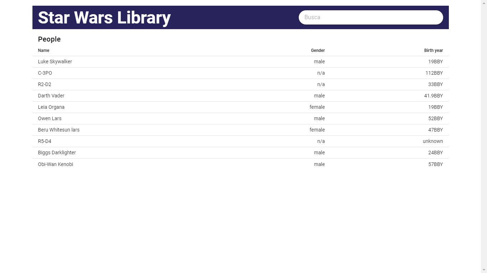
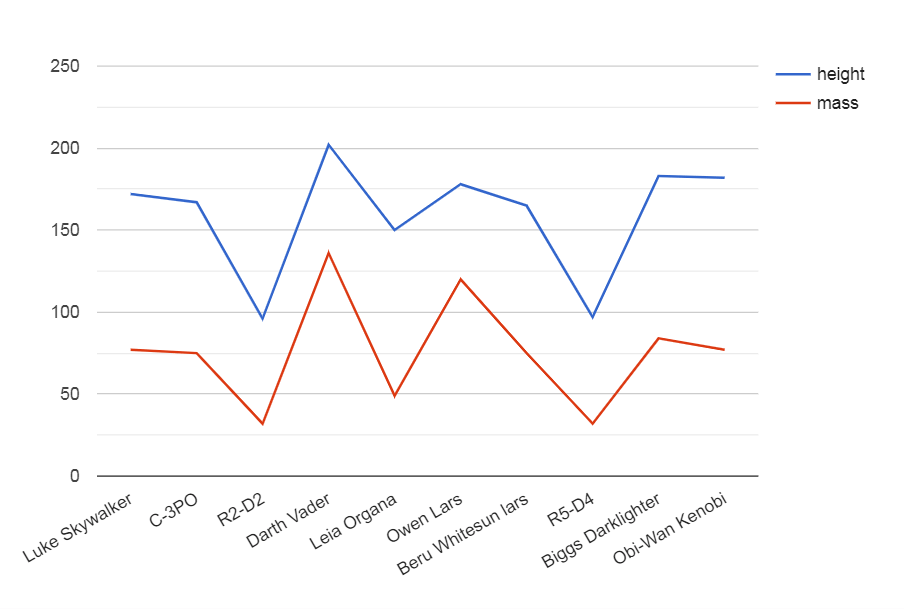

# Teste desenvolvedor front-end DIGA #

### Introdução ###

 _Resolução: 1366x768px_

O projeto consiste em uma biblioteca do universo canônico de Star Wars.

A partir do código existente, o candidato deverá implementar as funcionalidades propostas, abrindo
um pull request no repositório de código contendo os códigos-fontes e o arquivo README.md contendo
instruções de como rodar o projeto e quaisquer outras observações que julgar necessário.

### Estrutura: ###

O projeto foi desenvolvido utilizando os frameworks [Vue v3.x](https://vuejs.org/) e
[Vuetify 3.x](https://next.vuetifyjs.com/). Entretanto, é válido usar Vue v2.x, bem como
[TypeScript](https://www.typescriptlang.org/) ou outra melhoria.

Gerenciador de pacotes: [Yarn](https://yarnpkg.com/)

Ferramenta de build: [Vite](https://vitejs.dev/)

### API: ###

Os dados são fornecidos pela API do [SWAPI](https://swapi.dev/).

Os dados são retornados em formato JSON.

### Instruções: ###

1) Faça um fork do repositório;

2) Clone o repositório para a sua máquina local;

3) Instale o Yarn (caso não esteja instalado);

4) Rode `yarn install` pelo prompt de comando na pasta do projeto;

5) Abra um pull request para entregar o teste.

### O que deve ser feito: ###

**1) Frameworks:**

Faça bom uso dos frameworks e crie mais componentes.

**2) Implemente a busca:**

Ao digitar no campo de busca, os dados devem ser filtrados conforme o seu nome ou título.

**3) Desenvolva a paginação dos dados:**

A página deve possibilitar a exibição de mais dados paginados. 

Fique livre para usar componentes de paginação ou um botão "carregar mais" ou ainda um carregamento
automático.

### Que a Força te leve a uma galáxia distante: ###

**1) Desenvolva a navegação por rotas:**

Escolha ao menos dois dos recursos seguintes: `films`, `people`, `planets`, `species`, `starships`
ou `vehicles`, e crie páginas para exibição da listagem dos mesmos.

**2) Dashboard:**

Crie uma página para exibição de gráficos e mostre ao menos quatro gráficos distintos.

Fique livre para escolher os tipos dos gráficos bem como a complexidade. Você também é livre para
usar bibliotecas.

Por exemplo:

 _Gráfico linha relacionando o peso e a altura das pessoas_

**3) Estrutura do projeto:**

Realizar melhorias na estrutura do projeto.

Uma sugestão aqui seria separar os serviços dos componentes.

### Que a Força te leve a uma galáxia muito, muito distante: ###

**1) Organização e padronização de código:**

Usar ferramentas de análise de código, [ESLint](https://eslint.org/), por exemplo.

**2) Internacionalização:**

Adaptar para tradução, por exemplo, utilizando [Vue I18n](https://vue-i18n.intlify.dev/).

### O que pode ser feito: ###

**1) Acabamento:**

Quaisquer implementos funcionais e/ou visuais que melhorem a experiência do usuário na página são
bem-vindas.

### O que vamos avaliar: ###

1) Correta implementação das funcionalidades;

2) Legibilidade, simplicidade e manutenibilidade do código;

3) Melhor uso dos frameworks;

4) Histórico de commits.

## _Que a Força esteja com você!_ Yoda ##
